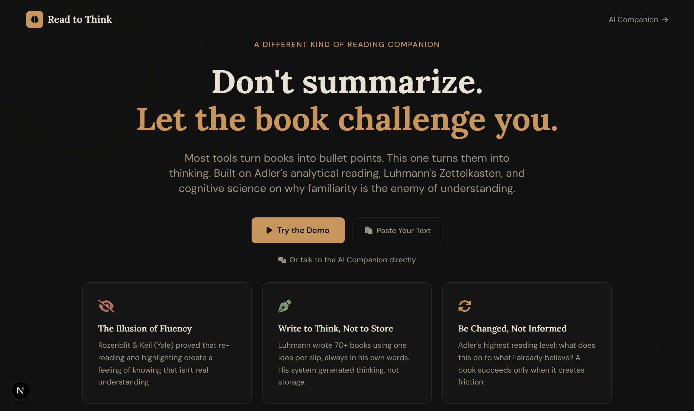

<div align="center">

# Read to Think

**A reading companion that refuses to summarize.**
Built on Adler's analytical reading, Luhmann's Zettelkasten, and the cognitive science of why familiarity is the enemy of understanding.

[**Live demo →**](https://read-to-think-sage.vercel.app)



</div>

---

## Why

Most reading tools turn books into bullet points. You finish with a feeling of knowing — and forget within a week. That feeling is the **illusion of fluency**: re-reading and highlighting build *recognition*, not the ability to *reconstruct* an idea from scratch.

Read to Think is built to fight that. There is **no path in the app that produces a summary** — not in the demo, not in the chat. Every feature exists to make a book argue with what you already believe.

## Two modes

| Deep Read | AI Socratic Companion |
| --- | --- |
| Paste a passage. It extracts the claims and walks you through each one: **think first** (write your belief before the author speaks) → **reveal & take a stance** → **write an atomic note** in your own words. | A chat that never summarizes. It questions your reading, catches the illusion of fluency, and pushes you to reconstruct ideas instead of recognising them. |

## Features

- **Think-first gating** — the author's reasoning stays locked until you commit your own.
- **Stance, not a checkbox** — a spectrum from disagree to agree, with your reasoning.
- **Atomic notes** — one idea, your words, what *changed* in your thinking.
- **Fluency check** — flags when a note just reuses the author's vocabulary; optional deeper AI check.
- **Spaced repetition** — resurfaces notes and asks you to rebuild them from memory (SM-2 style).
- **Linked notes** — connect ideas Zettelkasten-style; export carries `[[links]]`.
- **Export** — your notes as Markdown (Obsidian-flavored) or JSON.
- **Bring your own key** — OpenAI or **Groq (free)**. The key lives only in your browser and streams directly to your chosen provider — it never touches a server.

## Tech

- [Next.js](https://nextjs.org) (App Router) + React, plain JSX
- Tailwind CSS — theme ported 1:1 from the original single-file prototype
- Browser-direct streaming to any OpenAI-compatible endpoint (OpenAI, Groq, Together, OpenRouter, local LLMs)
- `localStorage` for notes, reviews, and links — no backend, fully static, deploy anywhere

## Run locally

```bash
npm install
npm run dev
```

Open <http://localhost:3000>. Click the gear icon, pick a provider, and paste your key:

| Provider | Base URL | Get a key |
| --- | --- | --- |
| OpenAI | `https://api.openai.com/v1` | platform.openai.com/api-keys |
| Groq (free) | `https://api.groq.com/openai/v1` | console.groq.com/keys |
| Custom | any OpenAI-compatible | — |

## Privacy

Your API key is stored only in your browser's `localStorage` and is sent **directly** to the provider you choose. There is no backend and no telemetry.

## Roadmap

Curated book database · chapter tracking · multi-book chat · syntopical (multi-book) reading. These need a server (Convex) and are not built yet.

## Project layout

```
app/          Next.js routes, layout, global styles
components/    Landing, Header, DeepRead, Chat, NotesSidebar, SettingsModal, ReviewModal, Toaster
lib/          providers · deepread · fluency · srs · links · store · format
scripts/      shot.mjs — regenerates docs/hero.png from a running dev server
```

---

<div align="center">
<sub>Built on Adler, Luhmann, and cognitive science. Your key never leaves your browser.</sub>
</div>
